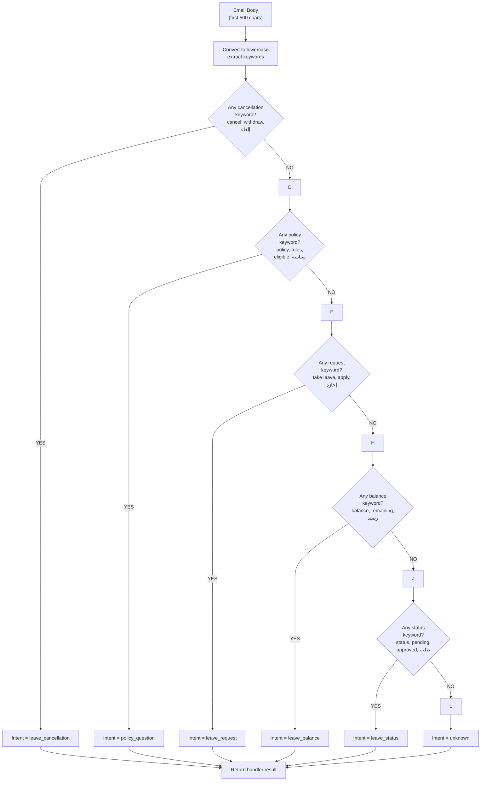
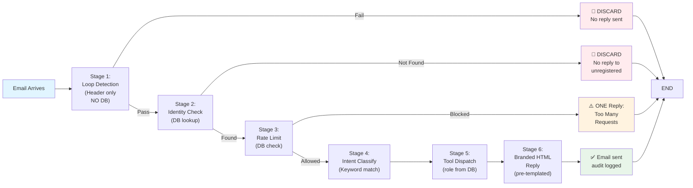
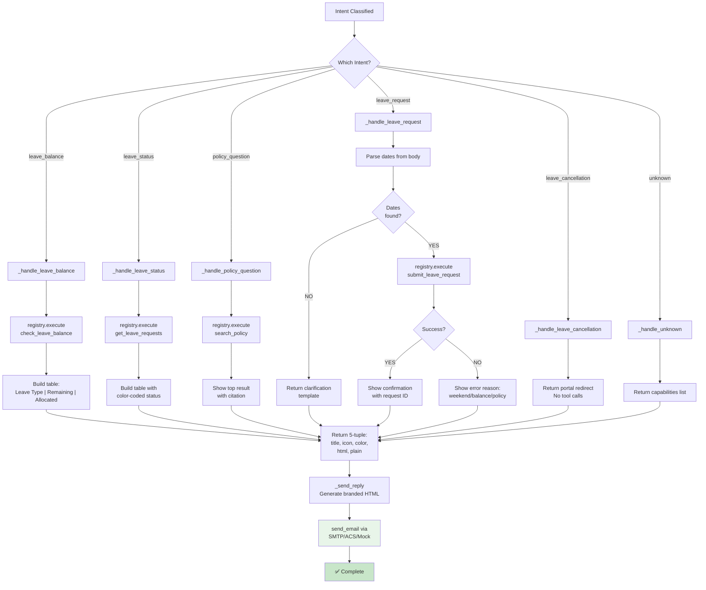
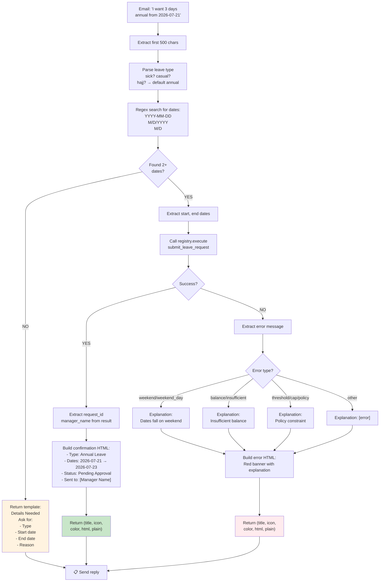
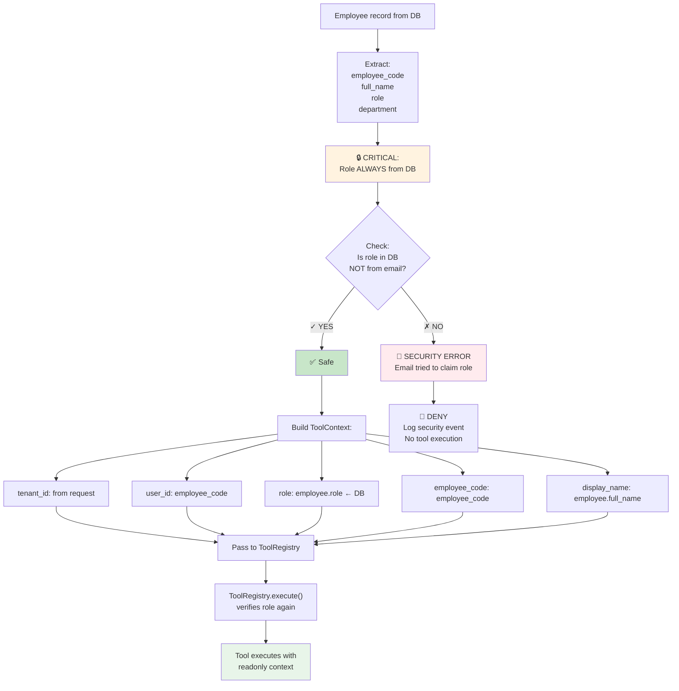
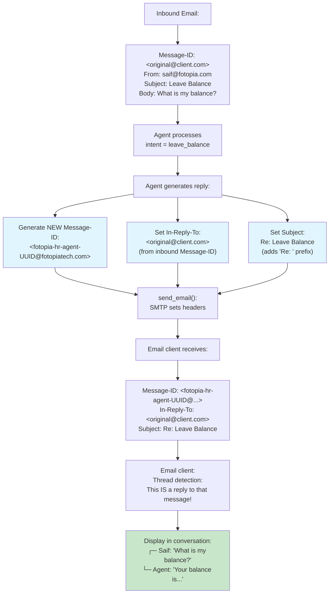
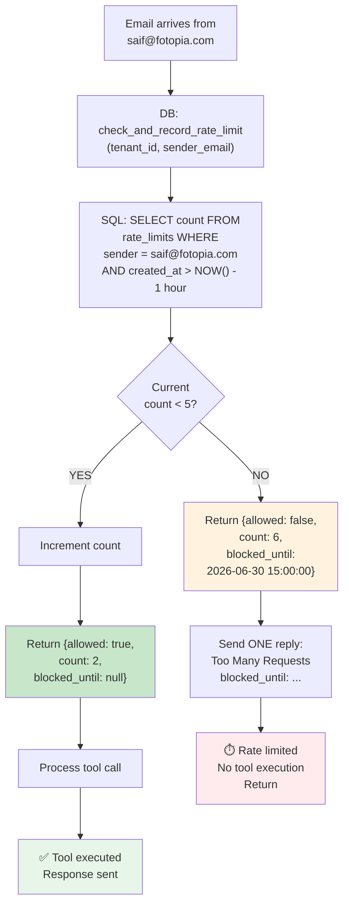
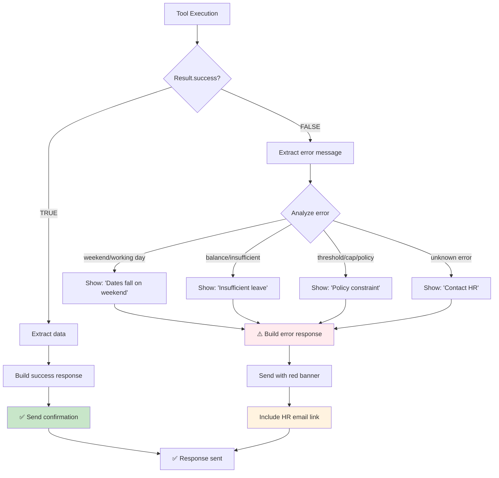
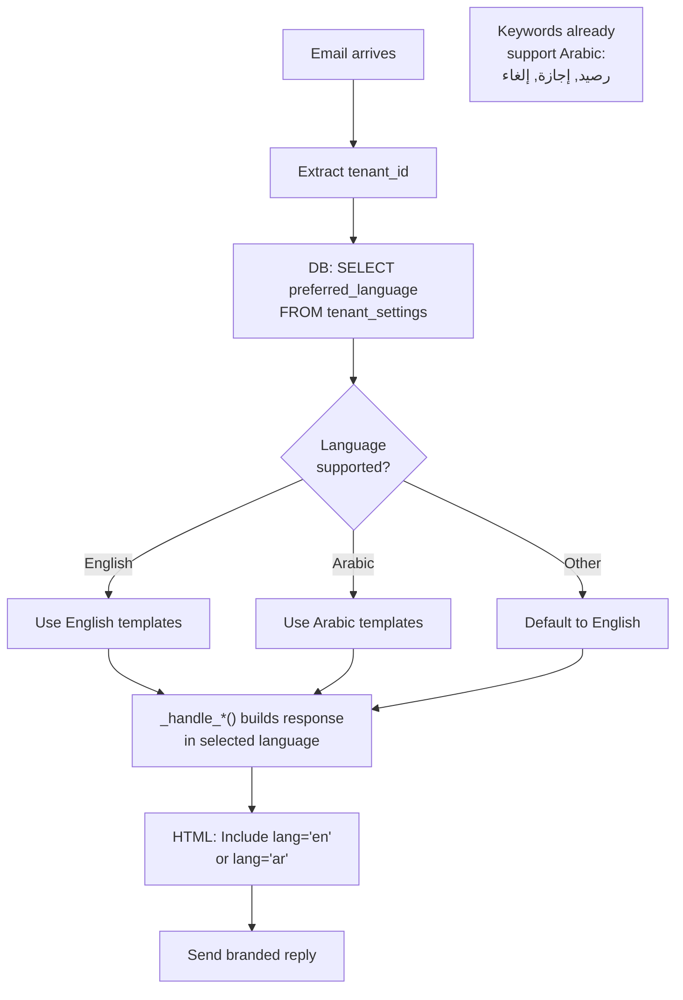

# Email Agent Flow Diagrams

## Complete Email Processing State Machine

```mermaid
stateDiagram-v2
    [*] --> LoopDetection
    
    LoopDetection --> CheckAutoReply{Is auto-reply\nheader?}
    CheckAutoReply -->|YES| Discard1["Discard<br/>(no DB calls)"]
    CheckAutoReply -->|NO| SelfEmailCheck
    
    SelfEmailCheck --> CheckSelf{Email from\nsystem address?}
    CheckSelf -->|YES| Discard2["Discard<br/>(prevent loops)"]
    CheckSelf -->|NO| IdentityCheck
    
    IdentityCheck --> QueryDB["DB: SELECT employee\nWHERE email = sender"]
    QueryDB --> EmployeeFound{Employee\nfound?}
    EmployeeFound -->|NO| Discard3["Discard<br/>(no signal to\nspammers)"]
    EmployeeFound -->|YES| RateLimit
    
    RateLimit --> CheckRL["DB: check_and_record_rate_limit"]
    CheckRL --> RLExceeded{Rate limit\nexceeded?}
    RLExceeded -->|YES| SendRLReply["Send ONE reply:<br/>Too Many Requests"]
    SendRLReply --> [*]
    RLExceeded -->|NO| IntentClass
    
    IntentClass --> ExtractSnippet["snippet = body[:500]"]
    ExtractSnippet --> ClassifyKeywords["Match keywords:<br/>cancel, policy,<br/>request, balance,<br/>status"]
    ClassifyKeywords --> IntentResult{Intent\ndetected?}
    
    IntentResult -->|leave_cancellation| Handler1["_handle_leave_cancellation"]
    IntentResult -->|policy_question| Handler2["_handle_policy_question<br/>→ search_policy tool"]
    IntentResult -->|leave_request| Handler3["_handle_leave_request<br/>→ submit_leave_request tool"]
    IntentResult -->|leave_balance| Handler4["_handle_leave_balance<br/>→ check_leave_balance tool"]
    IntentResult -->|leave_status| Handler5["_handle_leave_status<br/>→ get_leave_requests tool"]
    IntentResult -->|unknown| Handler6["_handle_unknown<br/>→ capabilities list"]
    
    Handler1 --> BuildContext["Build ToolContext<br/>role = employee.role<br/>(from DB only)"]
    Handler2 --> BuildContext
    Handler3 --> BuildContext
    Handler4 --> BuildContext
    Handler5 --> BuildContext
    Handler6 --> BuildContext
    
    BuildContext --> ExecuteTool["registry.execute(tool_name, args, ctx)"]
    ExecuteTool --> ToolResult["Tool returns:<br/>success: bool<br/>data: dict"]
    ToolResult --> BuildHTML["Build branded HTML<br/>response"]
    
    BuildHTML --> FormatResponse["Format (title, icon,<br/>color, html, plain)"]
    FormatResponse --> SendReply["_send_reply():<br/>- Generate Message-ID<br/>- Set In-Reply-To<br/>- Wrap in template<br/>- Call send_email()"]
    SendReply --> Audit["Log to audit_log:<br/>tool_name, actor_role,<br/>result, latency"]
    Audit --> [*]
    
    Discard1 --> [*]
    Discard2 --> [*]
    Discard3 --> [*]
```

---

## Intent Classification Decision Tree



---

## Security Pipeline (Order is INVARIANT)



---

## Tool Routing by Intent



---

## Leave Request Handler - Detailed Flow



---

## Security Context Building



---

## Email Threading (RFC 2822)



---

## Rate Limiting Mechanism



---

## HTML Response Template Structure

```
┌─────────────────────────────────────────────────────────┐
│ HEADER (Branded)                                        │
│ ┌─────────────────────────────────────────────────────┐ │
│ │ Fotopia HR System                                   │ │
│ │ WIN Holding Group — HR Portal                       │ │
│ └─────────────────────────────────────────────────────┘ │
├─────────────────────────────────────────────────────────┤
│ CONTENT AREA                                            │
│                                                         │
│   ICON (38px emoji)                                    │
│   📊                                                    │
│                                                         │
│   TITLE (color-coded)                                  │
│   Your Leave Balance                                    │
│   (#2563eb blue)                                       │
│                                                         │
│   MAIN CONTENT                                          │
│   Dear Saif Ahmed,                                     │
│                                                         │
│   Here is your leave balance:                          │
│   ┌─────────────────────────────────────┐             │
│   │ Type      │ Remaining │ Details     │             │
│   ├─────────────────────────────────────┤             │
│   │ Annual    │ 15.0 days │ of 21       │             │
│   │ Sick      │ 9.0 days  │ of 10       │             │
│   └─────────────────────────────────────┘             │
│                                                         │
│   Additional help text...                              │
│                                                         │
├─────────────────────────────────────────────────────────┤
│ FOOTER                                                  │
│ Fotopia HR System — Automated reply                    │
│ For assistance: hr@fotopia.com                         │
│                                                         │
│ Reply-Token: &lt;fotopia-hr-agent-UUID@domain&gt;        │
└─────────────────────────────────────────────────────────┘
```

---

## Test Coverage Map

```mermaid
graph TD
    A["10 Main Security Tests"] --> B["Stage 1: Loop Detection"]
    A --> C["Stage 2: Identity Check"]
    A --> D["Stage 3: Rate Limit"]
    A --> E["Stages 4-5: Intent + Tool"]
    A --> F["Stage 6: Reply Headers"]
    
    B --> B1["test_auto_reply_header_skipped"]
    C --> C1["test_unregistered_sender_no_reply"]
    C --> C2["test_self_email_skipped"]
    D --> D1["test_rate_limit_blocks_reply"]
    
    E --> E1["test_leave_balance_keyword_routes_to_tool"]
    E --> E2["test_leave_status_keyword_routes_to_tool"]
    E --> E3["test_policy_question_returns_canned_response"]
    E --> E4["test_unknown_intent_returns_canned_response"]
    E --> E5["test_role_from_db_not_body"]
    
    F --> F1["test_reply_sets_in_reply_to_header"]
    
    A --> G["Intent Classification Tests"]
    G --> G1["test_leave_request_detected"]
    G --> G2["test_leave_cancellation_detected_before_request"]
    G --> G3["test_balance_keywords_detected"]
    G --> G4["test_arabic_balance_keyword"]
    
    A --> H["Handler Unit Tests"]
    H --> H1["test_balance_handler_formats_html_table"]
    H --> H2["test_status_handler_formats_status_badges"]
    H --> H3["test_leave_request_handler_asks_for_clarification"]
    H --> H4["test_cancellation_handler_redirects_to_portal"]
```



---

## Error Paths (Graceful Degradation)



---

## Multi-Language Support (Future-Ready)



